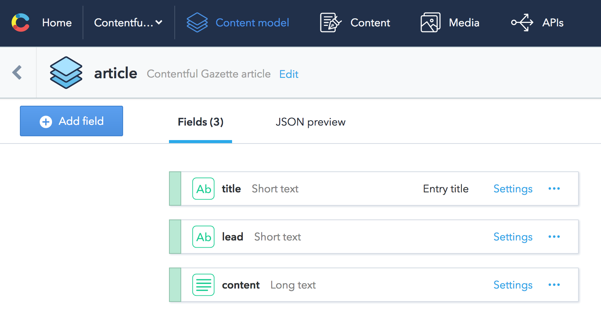
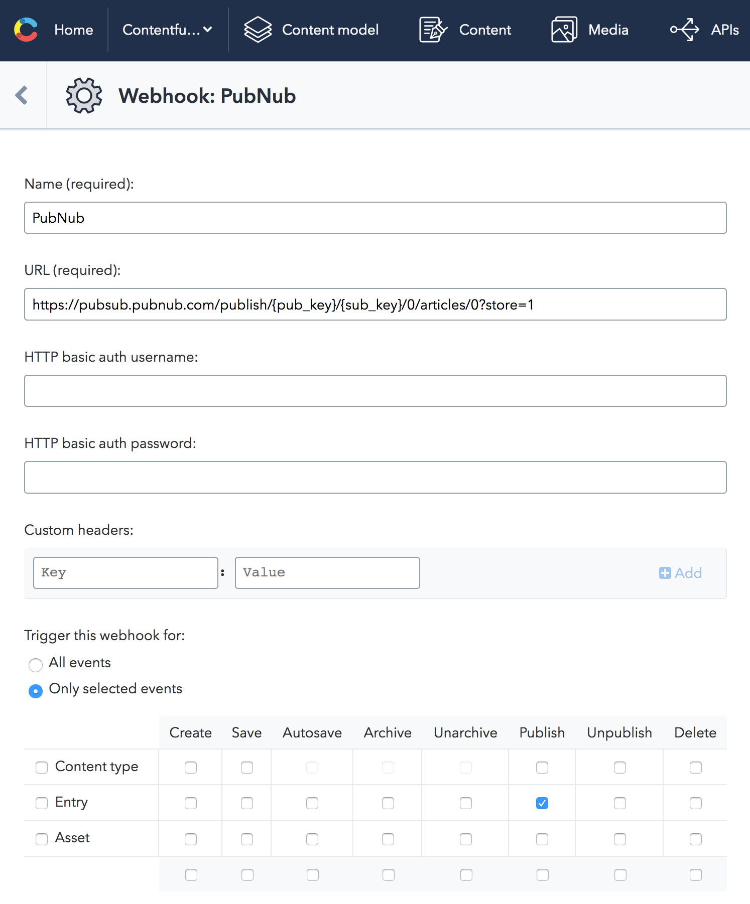

# Contentful Gazette

*bidirectional real-time content management and delivery*

## Disclaimers

This application was produced during a hackathon. It's a quick Proof of Concept created in 8h. It's not ready to be used in production.

### Known shortcomings

- there's no [server side rendering](https://facebook.github.io/react/docs/react-dom-server.html). It won't work without JavaScript enabled and load times will most likely suffer
- entry changes are populated with the real-time sync faster than they end up in the CDA. A page refreshed right after syncing may still show the previous version. To mitigate this problem we could use `localStorage` to cache versions received with the sync channel
- failed update are not reverted from the state of the app. You can provide a value that won't pass validations and will be rejected by the CMA, but it'll stay as is in the front-end

### Security

**Never ever give your CMA token away to applications you don't trust**. Contentful Gazette will store your CMA token only until the end of a session. You can verify what we do with your token by studying the code of [src/contentful.js](./src/contentful.js).

## Setting up your own Gazette

### Prepare content

1. create a new space in [Contentful](https://www.contentful.com)
2. create a content type with ID `article` consisting of 3 fields: `title`, `lead`, `content` (see below)
3. create a Content Delivery API key (or use the default one)
4. write some articles :)

### Run it locally and on GitHub Pages

1. update [src/config.json](./src/config.json) with your space ID and the CDA key
2. install dependencies with `npm install`
3. start dev server by running `npm run build-dev`
4. push it to GitHub Pages using `npm run deploy-gh`

### Get live updates

1. create a [PubNub](https://www.pubnub.com/) application with a key set
2. for your space create a webhook for entry publication events calling PubNub (see below)
3. update [src/config.json](./src/config.json) with your PubNub subscribe key

### Appendix: content type



```js
{
  "name": "article",
  "description": "Contentful Gazette article",
  "displayField": "title",
  "fields": [
    {
      "name": "title",
      "id": "title",
      "type": "Symbol",
      "localized": false,
      "required": false,
      "disabled": false,
      "omitted": false,
      "validations": []
    },
    {
      "name": "lead",
      "id": "lead",
      "type": "Symbol",
      "localized": false,
      "required": false,
      "disabled": false,
      "omitted": false,
      "validations": []
    },
    {
      "name": "content",
      "id": "content",
      "type": "Text",
      "localized": false,
      "required": false,
      "disabled": false,
      "omitted": false,
      "validations": []
    }
  ],
  "sys": {/* redacted */}
}
```

### Appendix: webhook

First you have to compose your publish URL. Refer the [PubNub documentation](https://www.pubnub.com/docs/pubnub-rest-api-documentation#publish-subscribe-publish-v1-via-post-post):

```
https://pubsub.pubnub.com/publish/{pub_key}/{sub_key}/0/articles/0?store=1
```

Then this URL should be used for as a [Contentful webhook](https://www.contentful.com/developers/docs/concepts/webhooks/). Please note it should be triggerd only on entry publication.



## Authors

This project won the 2017 Winter Hackathon at Contentful.

Contributors:

- [andrefs](https://github.com/andrefs) (code)
- [hlabas](https://github.com/hlabas) (product ownership)
- [jelz](https://github.com/jelz) (code)
- [joaoramos](https://github.com/joaoramos) (visuals)
- [TimBeyer](https://github.com/TimBeyer) (code)
